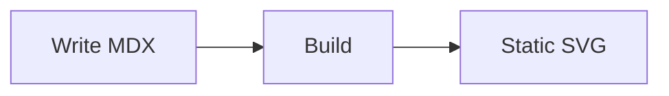

Every page is a `.md` or `.mdx` file. MDX is a superset of Markdown that can import and render React components. Plain `.md` files work equally well when you don't need that.

# Markdown features

folio.md enables [GitHub Flavored Markdown](https://github.github.com/gfm/) via `remark-gfm`, which adds:

- **Tables**: see [Configuration](/guide/configuration) for examples
- **Strikethrough**: `~~text~~`
- **Task lists**: `- [x] done` / `- [ ] todo`
- **Autolinks**: bare URLs become links automatically

# Mermaid diagrams

Wrap a Mermaid diagram in a fenced code block tagged `mermaid`. folio.md renders it to SVG at build time and ships no JavaScript to the browser. When you enable both light and dark modes, folio.md renders each diagram twice, once per theme, and uses CSS to show the correct version. Only the active theme's SVG is visible at any time.

````mdx

````

# Syntax-highlighted code blocks

Tag a fenced block with a language identifier and Shiki highlights it at build time. folio.md injects a header bar with the language name and a copy button into every code block.

To show a filename in the header bar, add `title="filename"` to the opening fence:

````mdx
```ts title="src/main.ts"
console.log("hello");
```
````

::: tip
folio.md warns at build time when heading levels skip, for example an `h3` that follows an `h1` without an intervening `h2`. It also warns when a page has more than 10 headings and suggests splitting the page.
:::

# Callout blocks

Use `:::type` containers to draw attention to important content. Four types are available: `note`, `tip`, `warning`, and `danger`.

````mdx
:::tip
This is a tip.
:::
````

Callout blocks support all standard Markdown inside them, including inline code, links, and lists.

# File naming and sidebar order

folio.md strips numeric prefixes from file names to build the URL slug but uses them to sort sidebar entries. Without a numeric prefix, entries sort alphabetically.

| File name | URL slug | Sidebar position |
|---|---|---|
| `01.Getting Started.mdx` | `/guide/getting-started` | Sorted by `01` prefix |
| `02.Deployment.mdx` | `/guide/deployment` | Sorted by `02` prefix |
| `configuration.mdx` | `/guide/configuration` | Sorted alphabetically |

# Nested folders

Folders inside the content directory become collapsible sidebar sections. folio.md derives the section label from the folder name, stripping numeric prefixes. Nesting deeper than 3 path segments emits a build warning.

## Section metadata with `_section.mdx`

Place a `_section.mdx` file directly inside a top-level folder to override the section's sidebar title and icon:

```
docs/
  guide/
    _section.mdx
    getting-started.mdx
    configuration.mdx
```

```mdx
---
title: Guide
icon: Book
---
```

`_section.mdx` never renders as a page. It must sit exactly one level deep. Placing it inside a sub-folder triggers a build warning and folio.md ignores it.

# Frontmatter

See the [Frontmatter Reference](/reference/frontmatter) for all supported fields with types, defaults, and examples.
